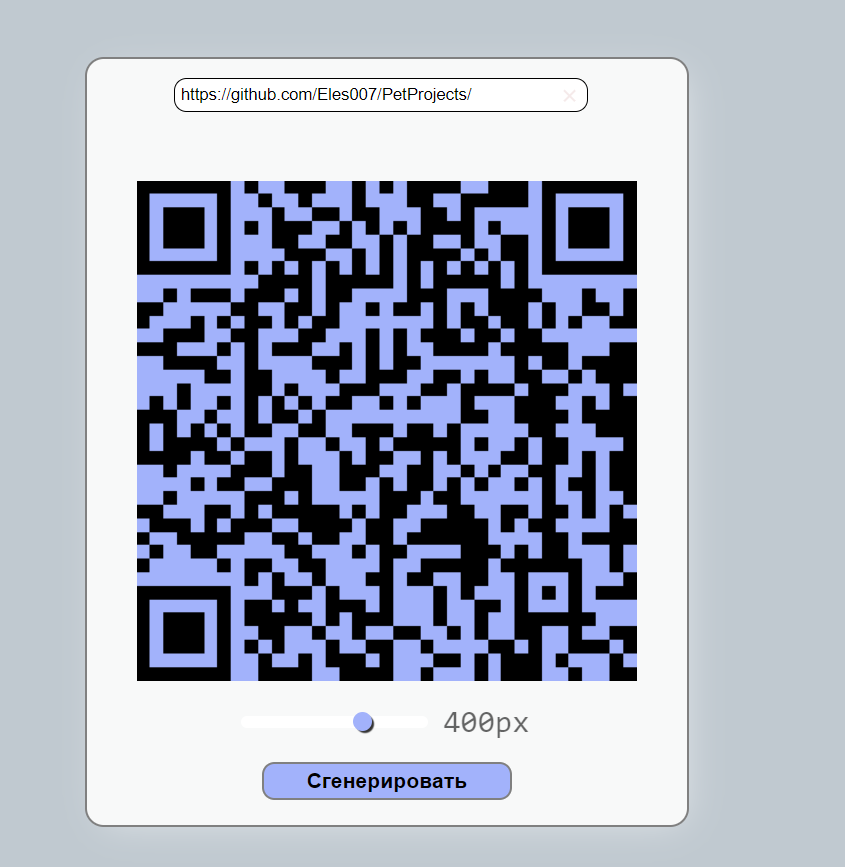

# Проекты для развития
1. `calculate`:Калькулятор с интерфейсом js/html/css 
2. `fitnessTracker`:Фитнес трекер с проверкой ввода данных, обычный вывод данных js/html/css 
3. `generatorQrcodePassword`:Генератор qr-coda со стилизацией js/html/css

